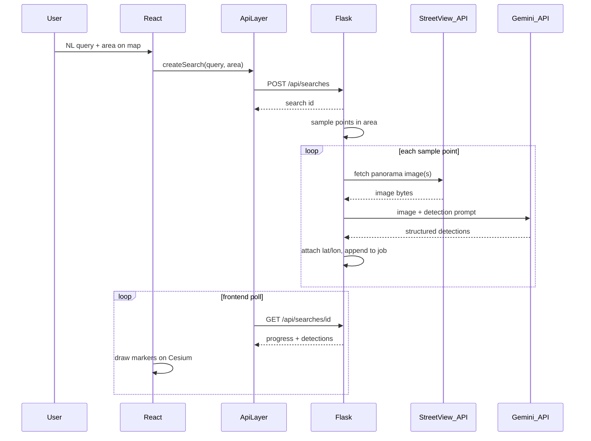

# Cartographer — Full Planning Document

Canonical planning dump for the Cartographer application (Eric Wang). Source of truth for product direction, architecture, and v1 implementation.

---

## 1. Product

Cartographer is a **search engine for the physical world**. Traditional maps find named places. Cartographer finds **visually identifiable objects and infrastructure** in a geographic area by analyzing street-level imagery.

Examples: bike racks near a university, benches along a route, curb ramps in a neighborhood, drinking fountains in a park, accessible entrances, crosswalks.

**Two user inputs:** what to find, and where to look.

**Pipeline:**
`User Query → Geographic Search Area → Street View Imagery → Gemini Vision Analysis → Geolocated Detections → Interactive Map`

---

## 2. Location & layout

All app code under:

`/Users/eric/Desktop/cartographer/eric_wang/`

```
cartographer/                         # git root (existing GitHub remote)
  README.md                           # pointer into eric_wang/
  eric_wang/
    PLANNING.md                       # this document
    README.md                         # how to run + required API keys
    .cursor/rules/                    # Cartographer agent rules
    .cursor/skills/                   # Cartographer agent skills
    frontend/                         # Vite + React + TS + shadcn + Cesium
    backend/                          # Flask + uv
```

---

## 3. How it works (end-to-end)



### Frontend role
- Map-first Cesium workspace
- Capture query + search area (viewport / radius / region)
- Call typed API layer (never raw `fetch` in UI components)
- Poll job; render progressive detections; selection detail
- Titanium stub for future cel-shading

### Backend role
- Own all secrets (Gemini + Google Maps/Street View keys stay server-side)
- Create search jobs
- Sample geographic points inside the search area
- Fetch Street View Static imagery for those points
- Call Gemini multimodal API to detect the requested object
- Parse structured results; geolocate to sample points; update job progress
- Expose status/detections to the frontend

### Search modes (architecture supports both)
- **Live search:** arbitrary NL query → Street View + Gemini (primary v1 path)
- **Precomputed layers:** stub API for future cached datasets (bike racks, benches, etc.)

---

## 4. Locked technical defaults

| Decision | Choice |
|---|---|
| Frontend | React + Vite + TypeScript + Tailwind + shadcn/ui |
| Map | CesiumJS; Titanium adapter stub |
| Backend | Flask + `uv` |
| Progressive results | Job create + poll (`POST/GET /api/searches`) |
| Imagery | Google Street View Static API |
| Detection | Google Gemini multimodal API (vision) |
| Gemini model | `gemini-2.0-flash` (speed/cost for many images; overridable via env) |
| Secrets | Backend `.env` only: `GEMINI_API_KEY`, `GOOGLE_MAPS_API_KEY`; optional `VITE_CESIUM_ION_TOKEN` |
| Default map focus | Ithaca / Cornell |
| Design | Black / white / neutral gray only; map-first; no accent color |

Without API keys, the API returns a clear configuration error (no fake detections pretending to be Gemini).

---

## 5. Backend: Street View + Gemini pipeline

Package: `eric_wang/backend/src/cartographer_api/`

### Modules
- `api/searches.py` — HTTP routes
- `jobs/store.py` — in-memory job store (status, progress, detections, error)
- `geo/sampling.py` — generate sample lat/lon points inside viewport/radius/polygon
- `imagery/street_view.py` — Street View Static API client
- `detection/gemini.py` — Gemini vision client; JSON-structured output
- `pipeline/run_search.py` — orchestrates sampling → imagery → Gemini → job updates (background thread)

### Street View sampling
- Density capped (e.g. max N points per search, configurable) to control cost/latency
- Per point: request Static Street View image(s); optionally 2–4 headings for coverage
- Skip points with no imagery (`status != OK`)
- Store image metadata on detections (`sourceImagery`: pano location, heading, URL or ref)

### Gemini detection
- Input: image(s) + user query / interpreted feature name
- Prompt asks for structured JSON: whether object present, labels, confidence, brief attributes, approximate image position hints if useful
- Parse response; only emit detections when present with usable confidence
- Model id from `GEMINI_MODEL` env (default `gemini-2.0-flash`)
- Use official Google GenAI Python SDK via `uv`

### Job lifecycle
`queued → running → completed | failed`
Progress ≈ processed_samples / total_samples. Detections append as each sample finishes so the map fills progressively.

### API contract

**`POST /api/searches`**
```json
{
  "query": "bicycle racks near Cornell",
  "area": {
    "type": "radius",
    "center": {"lon": -76.48, "lat": 42.45},
    "radiusMeters": 800
  }
}
```
→ `{ "id", "status", "interpretation": { "feature", "areaSummary" } }`

**`GET /api/searches/:id`**
→ `{ "id", "status", "progress", "detections": [...], "error" }`

**Detection model:** position, featureType, searchId, confidence, attributes, sourceImagery, detectedAt, model, verification?, metadata?

**`GET /api/layers/precomputed`** — stub list for future cached layers

---

## 6. Frontend architecture

- `src/app/` — shell, providers
- `src/components/ui/` — shadcn only
- `src/components/search/` — query bar, area mode, progress, detection detail
- `src/cesium/` — viewer, camera, area tools, detection entities, Titanium stub
- `src/api/` — typed client to Flask
- `src/models/` — Search, SearchArea, Detection, SearchLayer
- `src/state/` — map, jobs/layers, selection

### UX
Full-bleed map. Sparse overlay: wordmark, NL search, Viewport | Radius | Region, quiet progress (“Searching… 12 found”), markers, slim selection sheet (feature, confidence, source imagery when useful), small layer list. No dashboard, gradients, glass, badges, or decorative tech chrome.

### Titanium
```ts
attachTitanium(viewer) / detachTitanium(handle)
```
Stub until real package is provided.

---

## 7. Agent guidance (rules & skills)

Project Cursor rules and skills live under `eric_wang/.cursor/`.

### Rules
- `cartographer-core` — always-on product/design principles
- `cartographer-frontend` — React, shadcn, Cesium, API layer
- `cartographer-backend` — Flask, Street View, Gemini, secrets

### Skills
- `cartographer-search-pipeline` — extend or debug the live search job pipeline
- `cartographer-map-ui` — map-first UI and Cesium interaction work
- `cartographer-gemini-detection` — Gemini prompts, parsing, Street View sampling

### Installed Cursor skills to use with this project
- **create-rule** / **create-skill** — maintain the above
- **goal** — track multi-step build
- **split-to-prs** — split large landings
- **review-bugbot** / **review-security** — after core works
- **autopilot** — only with an open PR

---

## 8. Implementation order

1. Write `eric_wang/PLANNING.md` + Cursor rules/skills ← current
2. Scaffold frontend + backend (`uv`, Flask, Vite, shadcn)
3. Design tokens + map-first shell
4. Cesium + Titanium stub; default Ithaca camera
5. Models + API client + Flask job routes
6. Street View sampling + Gemini detection pipeline (env-gated)
7. Viewport / radius / region tools
8. Search UX: progress, markers, selection, layers, empty/error
9. `.env.example`, README, end-to-end verification

---

## 9. Out of scope (this pass)

Route/corridor drawing UI, clustering at scale, auth, saved/shared maps, real precomputed datasets, Titanium real implementation, client-side Gemini calls.

---

## 10. Guiding principle

Cartographer lets someone describe something in the physical world, say where to look, and get a map of where it exists — via Street View imagery and Gemini vision — while keeping that complexity behind a simple map-first interface.
